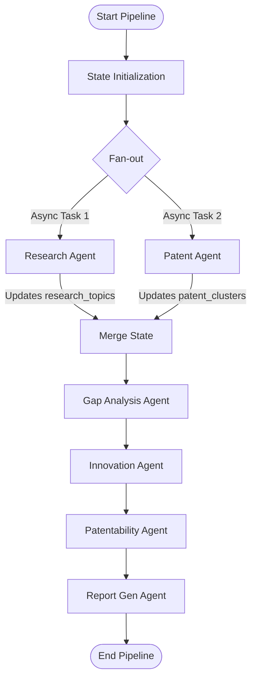

# Deep-Dive Analysis: PatentScout AI Build Plan

This document provides a comprehensive analysis of the 40-day build plan for **PatentScout AI**. It evaluates the architectural decisions, potential technical bottlenecks, API mechanics, validation logic, and mitigation strategies for deploying this system on a Windows environment.

---

## 1. Architectural Analysis & LangGraph Pipeline

### LangGraph Parallel Execution (Fan-out / Fan-in)
The system uses a parallel fan-out structure where **Agent 01 (Research)** and **Agent 02 (Patent)** run concurrently, merging their outputs at **Agent 03 (Gap Analysis)**.



#### Key Considerations for State Concurrency
1.  **State Merging**: Since `research_agent` writes exclusively to the `research_topics` key and `patent_agent` writes to the `patent_clusters` key, there are no write-collision conflicts.
2.  **Async Orchestration**: To achieve true parallel execution in a FastAPI request cycle, the graph execution must run in an async context. We will compile the state graph and invoke it using `.ainvoke()`, ensuring both agents execute concurrently without blocking the event loop:
    ```python
    # Compilation
    app = workflow.compile()
    # Async execution
    final_state = await app.ainvoke({"domain": "Electric Vehicles"})
    ```

---

## 2. API Integration & Data Retrieval Pipeline

### Academic Ingestion

#### arXiv API (Free, XML-based)
*   **Endpoint**: `http://export.arxiv.org/api/query`
*   **Format**: Atom 1.0 (XML format).
*   **Handling XML on Windows**: Instead of introducing heavy dependencies, we will use Python's built-in `xml.etree.ElementTree` to parse the Atom feed namespaces dynamically:
    ```python
    import xml.etree.ElementTree as ET
    # Handle the Atom XML namespace
    namespaces = {'atom': 'http://www.w3.org/2005/Atom'}
    root = ET.fromstring(xml_content)
    entries = root.findall('atom:entry', namespaces)
    ```

#### Semantic Scholar API (Free Tier, JSON-based)
*   **Endpoint**: `https://api.semanticscholar.org/graph/v1/paper/search`
*   **Rate Limits**: The public tier is limited to 100 requests per 5 minutes.
*   **Mitigation Strategy**: Implement exponential backoff inside `research_fetcher.py`. If a `429 Too Many Requests` is received, the code should sleep and retry, or gracefully fall back to relying purely on the arXiv API, ensuring the system remains functional.

---

## 3. Patent Ingestion

#### PatentsView API (Free, JSON POST-based)
*   **Endpoint**: `https://api.patentsview.org/patents/query`
*   **Query Payload**:
    ```json
    {
      "q": {"_text_any": {"patent_title": "electric vehicles"}},
      "f": ["patent_title", "patent_abstract", "patent_date", "patent_number", "assignee_organization"],
      "o": {"per_page": 50, "sort": [{"patent_date": "desc"}]}
    }
    ```
*   **Search Query Refinement**: If search queries are too narrow (e.g., "EV solid-state battery NMC cathode"), PatentsView may return zero results. We must add a query normalization function that simplifies search strings into standard keywords before hitting the API.

---

## 4. RAG Setup & Windows Compatibility

### ChromaDB Installation Challenges on Windows
*   **The Issue**: ChromaDB compiles native C++ bindings (`hnswlib`) during installation. On Windows, this requires **Microsoft Visual C++ 14.0 or greater** to build successfully. If these tools are missing on the developer's system, `pip install chromadb` will fail.
*   **Robust Fallback Plan**: 
    1.  **Primary**: Connect to a local Dockerized ChromaDB instance or use Qdrant Cloud.
    2.  **Fallback**: Implement a pure-Python lightweight vector search interface. Using `sentence-transformers` to generate embeddings, we can compute cosine similarities using standard `numpy` or basic Python math routines. This guarantees the application runs out-of-the-box even if native C++ compilation fails.

### Collection Strategy
We will create separate collections dynamically based on the domain input:
*   `research_{domain_slug}` (stores research papers)
*   `patents_{domain_slug}` (stores patent documents)

This partition prevents topic contamination, ensuring the Gap Agent does not compare a research paper directly with its own domain definition, but rather with patent trends.

---

## 5. LLM & Structured Output Validation (Gemini 2.5 Pro)

To run the pipeline on **Gemini 2.5 Pro** and guarantee structured output compliance, we will configure the system as follows:

### Required Python Dependency
We will replace the Anthropic SDK packages with Google's LangChain integration:
```bash
pip install langchain-google-genai
```

### Environment Configuration
The `.env` file should be updated to contain:
```bash
GEMINI_API_KEY=your_gemini_api_key_here
```

### Structured Output Configuration
We will use **Gemini's native structured JSON schemas** via LangChain's `with_structured_output` mapping to Pydantic:

```python
from langchain_google_genai import ChatGoogleGenerativeAI
from pydantic import BaseModel

class ResearchTopicList(BaseModel):
    topics: list[ResearchTopic]

# Initialize Gemini 2.5 Pro
llm = ChatGoogleGenerativeAI(
    model="gemini-2.5-pro",
    gemini_api_key=os.environ.get("GEMINI_API_KEY")
)

# Bind output schema
structured_llm = llm.with_structured_output(ResearchTopicList)
```

> [!TIP]
> Gemini 2.5 Pro provides highly reliable JSON Schema validation. Binding Pydantic schemas using `with_structured_output` forces the Gemini API to format its response as structured parameters, completely bypassing raw text parsing errors.

---

## 6. UI Design & Demoware Features

### The Gap Heatmap
To build the critical 2D grid visualization showing research activity vs. patent saturation:
*   **Y-axis**: Research Activity (`High`, `Medium`, `Low`)
*   **X-axis**: Patent Saturation (`High`, `Medium`, `Low`)
*   **Quadrant Targeting**: We will map our tech clusters into this grid. Items located in the **High Research / Low Patent** quadrant will be styled with an amber/gold glow, indicating them as high-value innovation white spaces.

```
                  Research Activity
                  ┌─────────┬─────────┬─────────┐
             High │  GAP 🌟 │  Active │ Saturated│
                  ├─────────┼─────────┼─────────┤
           Medium │  Empty  │ Monitor │  Active │
                  ├─────────┼─────────┼─────────┤
               Low │  Empty  │  Empty  │ Monitor │
                  └─────────┴─────────┴─────────┘
                       Low      Medium     High    Patent Saturation
```

---

## 7. Project Timeline & Task Milestones

We will track the 40-day lifecycle across these critical milestones:
*   **Milestone 1 (Days 1-7)**: Ingestion module & RAG pipeline verification.
*   **Milestone 2 (Days 8-18)**: Complete execution of all 6 agents in isolation using mocked datasets.
*   **Milestone 3 (Days 19-22)**: Compilation of the LangGraph state machine and CLI execution.
*   **Milestone 4 (Days 23-27)**: FastAPI backend endpoints and live WebSocket connection `/ws/{job_id}`.
*   **Milestone 5 (Days 28-36)**: Next.js frontend, interactive Scatter/Radar charts, and report exports.
*   **Milestone 6 (Days 37-40)**: Unit testing coverage and Railway/Vercel production deployment.
